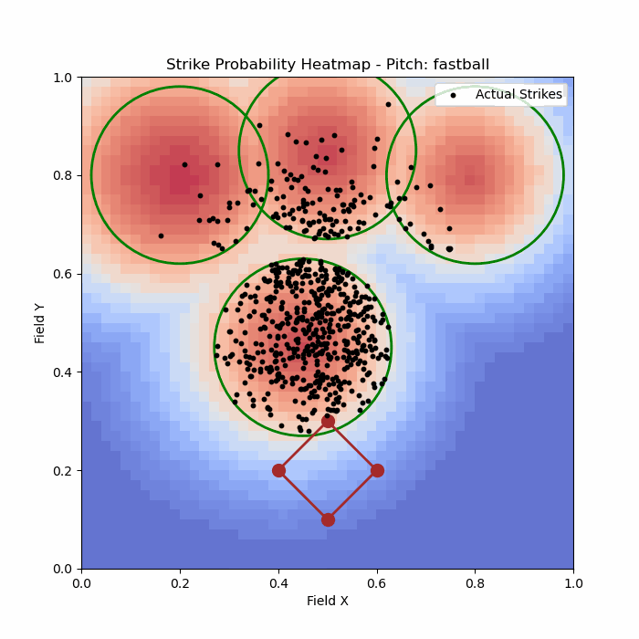

#  Nested Logit Pitcher Model

This project simulates a 3-stage nested logistic model for baseball:
1. Pitcher selects pitch type.
2. Batter decides to swing.
3. Ball location and airball probability determine if it's caught ("strike").

We visualize strike probabilities with an animated heatmap over a realistic baseball field.

---

 `Nested_logit_pitcher.ipynb` contains the full simulation, modeling, and animation.  
 Install requirements from `requirements.txt`.
